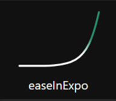
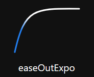
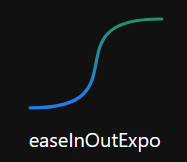
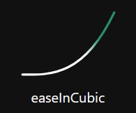
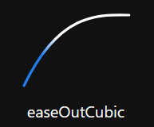
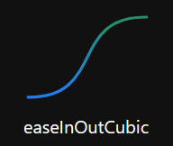

# Interpolate Node

## Inputs

###### Input
>Input value.

###### Time
>Time in seconds that the interpolation will take.

## Properties

###### Interpolate Type

When the input value changes this node will transition to the new value slowly following the selected curve over the time period. Note: There may be unexpected results when values are changed before the transition has completed. See [Easings.net](https://easings.net/) for the functions used.

>###### Linear
>>Straight line curve to new value.

>###### In Expo
>>

>###### Out Expo
>>

>###### In Out Expo
>>

>###### In Cubic
>>

>###### Out Cubic
>>

>###### In Out Cubic
>>

## Outputs

###### Output Name
>Outputs the result of the selected interpolation type.